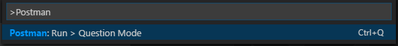

# Postman Runner for VSCode

***NOTE***: *This extension has been recently create and it is still in Beta and new features will come, please report your issues in <https://github.com/eridem/vscode-postman/issues> before negative feedback and I will help you out :-)*

Postman Runner for VSCode allows you to run Postman tests from your VSCode. It analyze the workspace folder and locate *collection* and *environment* files.

- Open VSCode on the folder or parent folder where collections and environments have been exported (section *Exporting collections and environments*)
- Open the `Command Palette`
- Choose `Postman > Run > Question Mode`

# Current features

- `Postman > Run > Question Mode`: It will ask you questions about how to trigger your tests. The bottom toolbar will show you the results of them.

- Display results on the toolbar

# Future features

- Show better reports
- Integration with the `Debug configurations`
- From your feedback: <https://github.com/eridem/vscode-postman/issues>

# * Exporting collections and environments

Export your collections and environment files from Postman to a directory or subdirectories:

## Known Issues

<https://github.com/eridem/vscode-postman/issues>

## Release Notes

### 1.0.0

Initial release, few features but happy with the idea.

# Copyright

Copyright (c) 2016 [Miguel Ángel Domínguez Coloma](http://eridem.net)

Licensed under [the MIT License](./LICENSE).